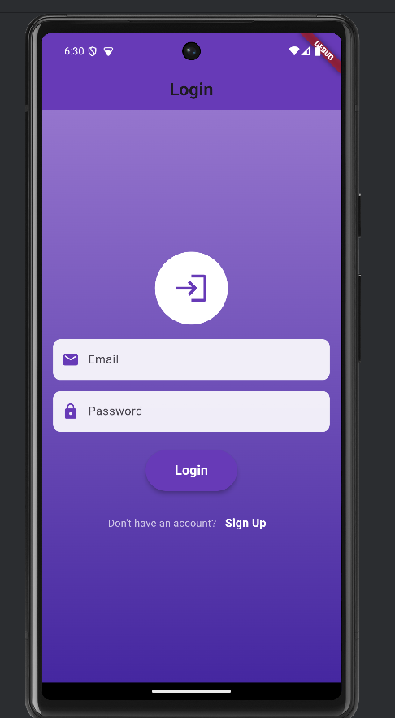
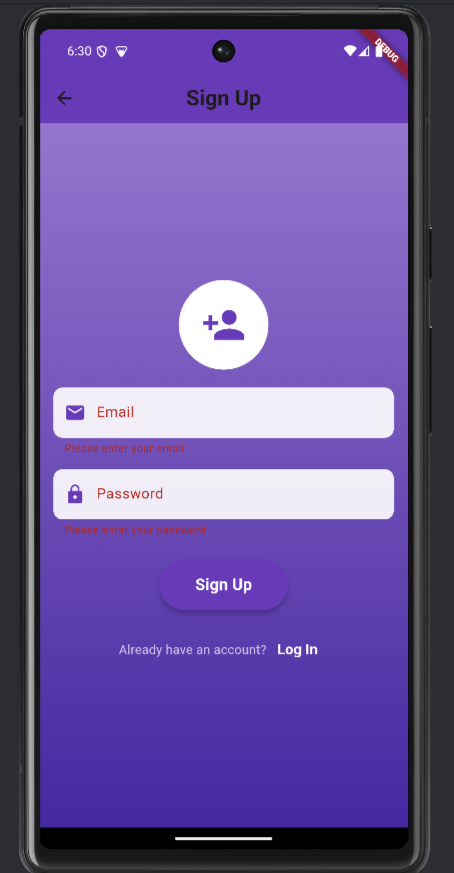
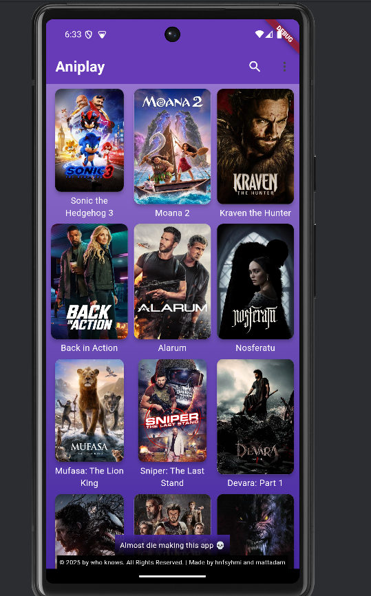
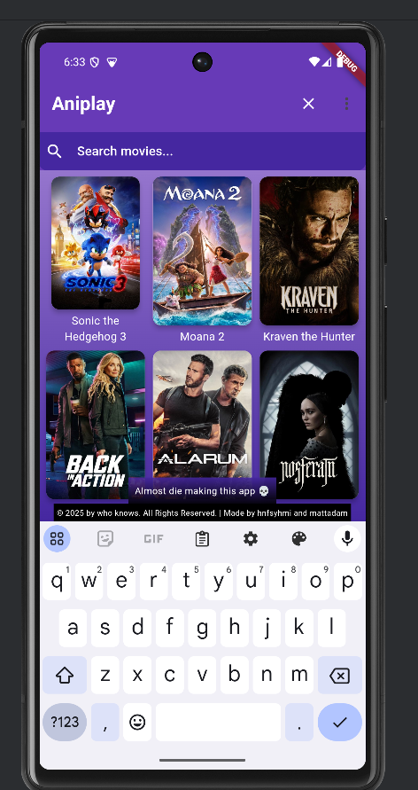

# Movie App

## Team Members
Below are the names and matric IDs of the team members who contributed to this project:

| Name                                     | Matric ID   |
|------------------------------------------|-------------|
| [MUHAMMAD ADAM IDURRAHMAN BIN MOHD SOPI] | [2218035]   |
| [ MUHAMMAD HANIF SYAHMI BIN MOHD FITRI ] | [2223305D] |


## Table of Contents
- [Summary and Objective](#summary-and-objective)
- [Project Details](#project-details)
- [Features](#features)
- [Technologies Used](#technologies-used)
- [Compilation and Running Instructions](#compilation-and-running-instructions)
- [Team Members](#team-members)
- [App Flow Screenshots](#app-flow-screenshots)
- [Additional Notes](#additional-notes)

## Summary and Objective
The Movie App is a Flutter-based mobile application designed to provide users with access to a vast database of movies using an API. The app allows users to:
- Browse popular movies
- Search for specific titles
- View detailed information about each movie
- Authenticate themselves using Firebase

### Key Objectives:
- Fetch and display movie data from an online API.
- Implement user authentication using Firebase.
- Provide a seamless user experience with intuitive navigation and responsive layouts.
- Demonstrate the use of modern Flutter widgets and design principles.

## Project Details
The Movie App is a multi-page Flutter application that leverages the power of APIs, Firebase authentication, and proper UI/UX design.

## Features
- **Movie Browsing**: Users can view a grid of popular movies fetched from an external API. Each movie poster is clickable, leading to a detailed view of the movie.
- **Search Functionality**: A search bar allows users to search for specific movies by title.
- **Authentication**: Users can log in or sign up using Firebase Authentication. Proper error handling ensures a smooth login/signup process.
- **Detailed Movie Information**: Each movie has a dedicated detail page showing its title, rating, release date, duration, and overview.
- **Proper Page Routing**: The app uses named routes for navigation between pages (e.g., Login, Signup, Home, Movie Details).
- **Responsive Layouts**: The app is designed to work on both small and large screens, ensuring a consistent user experience.

## Technologies Used
- **Flutter**: The app is built using Flutter, a cross-platform framework for developing mobile applications.
- **Firebase Authentication**: Used for user authentication (login and signup).
- **HTTP Library**: The `http` package is used to fetch movie data and images from an external API.
- **Flutter Widgets**: The app makes extensive use of widgets such as `GridView`, `TextFormField`, `ElevatedButton`, etc.
- **Gradient Backgrounds and Styling**: Modern UI elements like gradients, rounded corners, and shadows enhance the visual appeal.

## Compilation and Running Instructions

### Prerequisites
1. Install Flutter SDK: [Flutter Installation Guide](https://flutter.dev/docs/get-started/install)
2. Install an IDE (e.g., Android Studio or VS Code) with Flutter and Dart plugins.
3. Set up an emulator or connect a physical device.

### Steps to Run the App
```bash
git clone <your-github-repository-link>
cd movie-app
flutter pub get
flutter run
```

### Firebase Setup
1. Create a Firebase project and enable Authentication (Email/Password).
2. Download the `google-services.json` file and place it in the `android/app` directory.
3. Update the Firebase configuration in the `lib` folder if necessary.


## App Flow Screenshots
Below are snapshots of the app's flow, demonstrating its functionality and user interface:

### 1. Login Page
**Description**: The login page allows users to authenticate themselves using their email and password.



### 2. Signup Page
**Description**: New users can create an account by providing their email and password.



### 3. Home Page
**Description**: The home page displays a grid of popular movies fetched from the API.



### 4. Search Functionality
**Description**: Users can search for specific movies using the search bar.



### 5. Movie Details Page
**Description**: Clicking on a movie poster opens a detailed view of the movie.


**Note**: Replace `add-your-screenshot-link-here` with actual links to your app screenshots.

## Additional Notes
- **Use of Widgets**: The app demonstrates the use of various Flutter widgets such as `GridView`, `TextFormField`, `ElevatedButton`, and `Hero`.
- **HTTP Library**: The `http` package is used to fetch data from the movie API and load images dynamically.
- **Firebase Authentication**: Firebase is used for secure user authentication.
- **Proper Page Routing**: Named routes ensure smooth navigation between pages.
- **Proper Use of Layouts**: The app uses responsive layouts to ensure compatibility across different screen sizes.
